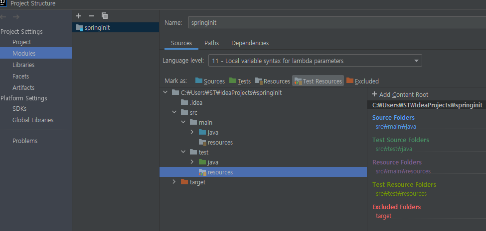

## 외부설정


### properties 우선순위


사용할 수 있는 외부 설정 

● properties 

● YAML 

● 환경 변수 

● 커맨드 라인 아규먼트


##### 프로퍼티 우선 순위 

1. 유저 홈 디렉토리에 있는 spring-boot-dev-tools.properties 

2. 테스트에 있는 @TestPropertySource 

   - ~~~java
     @ExtendWith(SpringExtension.class)
     @TestPropertySource(properties = "staek.name=aaaaaaaaa21") // 2순위
     class SampleListenerTest {
         @Autowired
         Environment environment;
     
         @Test
         public void contextLoads() {
             assertThat(environment.getProperty("staek.name"))
                     .isEqualTo("seongtaekkim");
         }
     }
     ~~~

3. @SpringBootTest 애노테이션의 properties 애트리뷰트 

4. 커맨드 라인 아규먼트 

   - ` java -jar .\target\spring-init-1.0-SNAPSHOT.jar --staek.name=seongatekk`

5. SPRING_APPLICATION_JSON (환경 변수 또는 시스템 프로티) 에 들어있는 프로퍼티 

6. ServletConfig 파라미터 

7. ServletContext 파라미터 

8. java:comp/env JNDI 애트리뷰트 

9. System.getProperties() 자바 시스템 프로퍼티 

10.  OS 환경 변수 

11. RandomValuePropertySource 

12.  JAR 밖에 있는 특정 프로파일용 application properties

13.  JAR 안에 있는 특정 프로파일용 application properties

14. JAR 밖에 있는 application properties

15. JAR 안에 있는 application properties 

    - ~~~java
      @Component
      public class SampleListener implements ApplicationRunner {
      
          @Value("${staek.name}")
          private String name;
          @Override
          public void run(ApplicationArguments args) throws Exception {
              System.out.println(name);
          }
      }
      ~~~

16.  @PropertySource 

17. 기본 프로퍼티 (SpringApplication.setDefaultProperties)




- test : /resources/application.properties 를 만들고
- 프로젝트 설정에서 Test Resources를 mark 해주면, test환경에서 `resources`를 사용할 수 있다.


#### @ConfigurationProperties vs @Value

- properties 값이 많을경우, `@Value`대신 java를 작성하여 관리할 수 있다.

```java
@Component
@ConfigurationProperties("staek")
public class SteakProperties {
    String name;
    int age;
    String fullName;

    public String getName() {
        return name;
    }

    public void setName(String name) {
        this.name = name;
    }

    public int getAge() {
        return age;
    }

    public void setAge(int age) {
        this.age = age;
    }

    public String getFullName() {
        return fullName;
    }

    public void setFullName(String fullName) {
        this.fullName = fullName;
    }
}
```

~~~java
@SpringBootApplication
@EnableConfigurationProperties(SteakProperties.class)
public class Application {
    public static void main(String[] args) {
        SpringApplication application = new SpringApplication(Application.class);
        application.setWebApplicationType(WebApplicationType.NONE);
        application.run(args);
    }
}
~~~

- `@EnableConfigurationProperties(SteakProperties.class)` 에서 관련 프로퍼티 클래스를 읽어오는 작업을 하는데, `springboot` 에 이미 포함되어 있어 생략해도 된다.


~~~java

@Component
//@Order(1) // ApplicationRunner가 여러개일때 순서를 정한다.
public class SampleListener implements ApplicationRunner {

    @Autowired
    SteakProperties steakProperties;

    @Override
    public void run(ApplicationArguments args) throws Exception {
        System.out.println(steakProperties.getAge());
        System.out.println(steakProperties.getFullName());
    }
}


~~~

- `SteakProperties` 는 `@Component` 에 의해 빈으로 등록되었으므로, `@Autowired` 하여 읽어와 사용할 수 있다.


