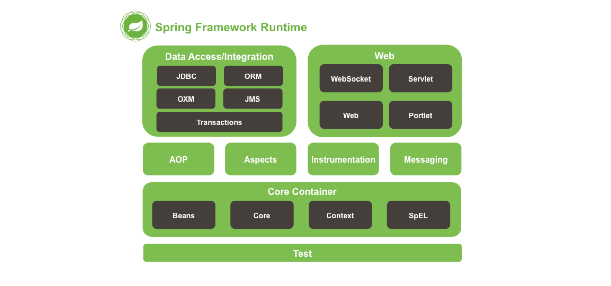
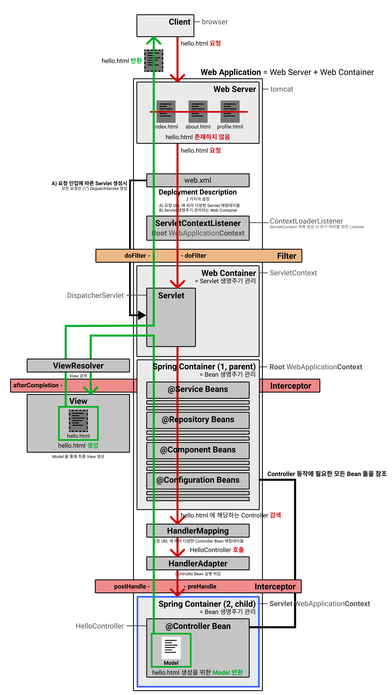
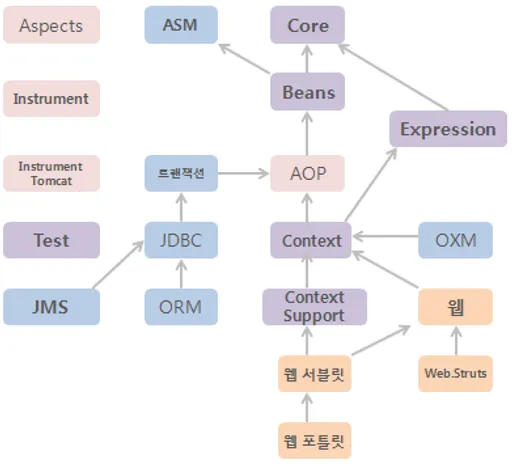

# SpringFramework architecture

## 실제 구동순서

- **Web Application** = **Web Server** + **Web Container**(= Servlet Container)
- **Web Container** 는 유저의 요청에 따라 **Servlet 자원에 대한 생명주기를 관리**합니다.
- webContainer : servlet 단위 처리
- springContainer : bean 단위처리

1. 웹 애플리케이션이 실행되면 Tomcat(WAS)에 의해 web.xml이 로딩된다.

   (load-on-startup으로 톰캣 시작시 servlet생성 가능하도록 설정 가능)

2. web.xml에 등록되어 있는 ContextLoaderListener(Java class)가 생성된다. ContextLoaderListener 클래스는 ServletContextListener 인터페이스를 구현하고 있으며, ApplicationContext를 생성하는 역할을 수행한다.

3. 생성된 ContextLoaderListener는 applicationContext.xml을 로딩한다.

4. applicationContext.xml에 등록되어 있는 설정에 따라 Spring Container가 구동된다. 이때 개발자가 작성한 비즈니스 로징에 대한 부분과 DAO, VO 객체들이 생성된다.

5. 클라이언트로부터 웹애플리케이션 요청이 온다. (FrontController 패턴에 의해 수행된다.)

6. DispatcherServlet(Servlet)이 생성된다. DispatcherServlet은 FrontController의 역할을 수행한다. 클라이언트로부터 요청 온 메시지를 분석하여 알맞은 PageController에게 전달하고 응답을 받아 요청에 따른 응답을 어떻게 할지 결정만 한다. 실질적인 작업은 PageControlle에서 이뤄지기 때문이다. 이러한 클래스들을 HandlerMapping, ViewResolver클래스라고 한다.

7. DispatcherServlet은 servlet-context.xml(spring-mvc.xml)을 로딩한다.

8. 두 번째 Spring Container가 구동되면 응답에 맞는 PageController들이 동작한다. 이때 첫 번째 Spring Container가 구동되면서 생성된 DAO, VO, ServiceImpl 클래스들과 협업하여 알맞은 작업을 처리하게 된다.

| ARTIFACTID               | DESCRIPTION                                                  |
| :----------------------- | :----------------------------------------------------------- |
| spring-aop               | 프록시 기반 AOP를 만들 때 필요한 어드바이스, 포인트컷, 프록시 팩토리빈, 자동 프록시 생성기 등을 제공 - 필수 라이브러리 - Beans |
| spring-aspects           | 스프링이 제공하는 AspectJ AOP를 사용할 때 필요한 모듈 - JPA 지원 기능 사용시 ORM, 트랜잭션 기능 지원시 Transaction 필요 |
| spring-beans             | 스프링 DI 기능의 핵심인 빈 팩토리와 DI 기능을 제공하는 모듈 - 빈 메타 정보, 빈 리더, 빈 팩토리의 구현과 프로퍼티 에디터가 포함 - 필수 라이브러리 - ASM, Core |
| spring-context           | 어플리케이션 컨텍스트 기능을 제공 - 어플리케이션 컨텍스트를 만드는 데 필요한 대부분의 기능과 빈 스캐너, 자바코드 설정 기능, EJB 지원, 포메터, 로드타임 위빙, 표현식, - 단순한 빈팩토리가 아닌 엔터프라이즈 어플리케이션 프레임워크로 사용하기 위해 반드시 필요합니다. - 필수 라이브러리 - AOP, Expression |
| spring-context-support   | JMX JNDI, 리모팅, 스케줄링, 스크립트 언어 지원, 검증기 등의 컨테이너로서의 주요한 기능을 담고 있습니다.어플리케이션 컨텍스트에서 필요로 하는 부가기능을 지원 - EhCache, 메일 추상화 서비스, CommonJ와 Quartz 스케줄링, FreeMarker, JasperReports, Velocity 팩토리 기능을 제공 - 위의 기능을 사용하지 않으면 해당모듈은 필요업지만, 스프링 MVC가 Context.Support에 의존하므로 스프링 MVC를 사용한다면 필수로 추가해야 한다. |
| spring-core              | 스프링 모듈에서 필요로 하는 공통 기능을 갖는 핵심 모듈 - 스프링에서 사용하는 주요 어노테이션, 컨버터, 상수, 유틸리티 클래스 등을 제공 - 선택적 의존 - ASM |
| spring-expression        | 스프링 표현식 언어(SpEL) 기능을 지원 - 필수 라이브러리 - Core |
| spring-instrument        | 스프링의 로드타임위버(LTW) 기능을 적용할 때 필요함. JVM의 -javaagent 옵션을 자용해 자바에이전트로도 사용됨. |
| spring-instrument-tomcat | 애플리케이션이 아닌 톰캣 서버의 클래스 로더로 사용하는 모듈  |
| spring-jdbc              | JDBC 템플릿을 포함한 JDBC 지원 기능을 제공 - JdbcTemplate 등의 JDBC 지원 오브젝트 외에도 스프링이 직접 제공하는 DataSource 구현 클래스들이 제공 - 필수 라이브러리 - 트랜잭션 |
| spring-jms               | 스프링의 JMS 지원 기능을 사용할 때 필요한 모듈 - 필수 라이브러리 - Transaction |
| spring-messaging         | 스프링 메세징 기능을 제공한다.                               |
| spring-orm               | 하이버네이트, JPA, JDO, iBatis와 같은 ORM에 대한 스프링의 지원 기능 - 내부적으로 JDBC를 사용한다. - 필수 라이브러리 : JDBC |
| spring-oxm               | Object/XML Mapping                                           |
| spring-test              | Test는 스프링의 테스트 지원기능을 가진 모듈 (테스트 컨텍스트 프레임워크나 목 오브젝트 등을 이용) |
| spring-tx                | 스프링의 데이터 액세스 추상화의 공통 기능을 담고 있습니다. - DataAcssessException 예외 계층구조와 트랜잭션 추상화 기능, 트랜잭션 동기화 저장소 그리고 JCA 기능을 포함 - 필수 라이브러리 - Context |
| spring-web               | 스프링 웹 기술의 공통적인 기능을 정의한 모듈 - 바인딩, 컨텍스트 로더, 필터, 멀티파트, 메세지 컨버터 기능을 제공 - 스프링 MVC 외에도 스프링이 지원하는 스트럿츠, JSF 등을 적용할 때 필요 - Caucho, HttpInvoker, JAX-RPC, JAX-WS 등의 리모팅 기능도 포함 - 필수 라이브러리 - Context |
| spring-webmvc            | 스프링 MVC 기능을 제공하는 모듈 - 필수 라이브러리 - Web, Context.Support |
| portlet                  | Portlet 개발에 사용하는 스프링 모듈 - 필수 라이브러리 - Web.Servlet |
| spring-websocket         | WebSocket and SockJS infrastructure, including STOMP messaging support |
| spring -asm              | ASM 모듈은 클래스 바이트코드 조작 및 분석 프레임워크인 ASM을 재 패키징한 모듈입니다. - ASM 프레임워크는 스프링 뿐 아니라 여러 프레임워크에서 및 라이브러리에서 사용되는데 이때 스프링 프레임워크와 ASM을 사용하는 다른 프레임워크와의 충돌을 방지하기 위해 org.springframework.asm 패키지로 재패키징해 독립적인 모듈로 제공합니다. |

## reference

[스프링 모듈 의존관계 설명](https://dololak.tistory.com/2)

[ApplicationContext 와 WebApplicationContext 차이](https://dololak.tistory.com/21?category=636502)

[스프링 동작순서](https://aaronryu.github.io/2021/02/14/a-tutorial-for-spring-mvc-and-security/)