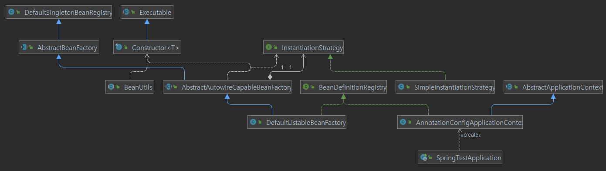

# Spring beans(1)


### 개요

SpringFramework의 `AnnotationConfigApplicationContext `생성을 통한 빈 등록 및 빈 생성 절차를 알아보자.


#### SpringTestApplication.java

```java
ApplicationContext context = new AnnotationConfigApplicationContext(AppConfig.class);
String[] beanNames = context.getBeanDefinitionNames();
for (String name : beanNames) {
   System.out.println(name);
}
```

- @Configuration을 정의한 AppConfig.java를 이용해서 `AnnotationConfigApplicationContext` 를 생성한다.

- `AnnotationConfigApplicationContext` 를 생성할 때 빈이 등록,생성되는데 디버깅을 통해 대략적인 순서를 알아보자.

  

#### AnnotationConfigApplicationContext.java

```java
public AnnotationConfigApplicationContext(Class<?>... componentClasses) {
   this();
   register(componentClasses);
   refresh();
}
```

- 생성자 코드 중에 `register`메서드는 빈 등록, `refresh` 메서드는 빈 생성을 담당한다.

  

### 1. register 메서드 - 빈 등록

```java
@Override
public void register(Class<?>... componentClasses) {
   Assert.notEmpty(componentClasses, "At least one component class must be specified");
   StartupStep registerComponentClass = this.getApplicationStartup().start("spring.context.component-classes.register")
         .tag("classes", () -> Arrays.toString(componentClasses));
   this.reader.register(componentClasses);
   registerComponentClass.end();
}
```

- this.reader.register(componentClasses); 메서드로 이동하면 , `AnnotatedBeanDefinitionReader`클래스로 이동한다.

  

#### AnnotatedBeanDefinitionReader.java

- 상단 주석을 보면, Register a bean from the given bean class, deriving its metadata from class-declared annotations. 이라는 표현이 있다. 프로그래머가 annotation으로 정의한 빈을 등록하는 곳 같다.

```java
private <T> void doRegisterBean(Class<T> beanClass, @Nullable String name,
      @Nullable Class<? extends Annotation>[] qualifiers, @Nullable Supplier<T> supplier,
      @Nullable BeanDefinitionCustomizer[] customizers) {

   AnnotatedGenericBeanDefinition abd = new AnnotatedGenericBeanDefinition(beanClass);
   if (this.conditionEvaluator.shouldSkip(abd.getMetadata())) {
      return;
   }

   abd.setInstanceSupplier(supplier);
   ScopeMetadata scopeMetadata = this.scopeMetadataResolver.resolveScopeMetadata(abd);
   abd.setScope(scopeMetadata.getScopeName());
   String beanName = (name != null ? name : this.beanNameGenerator.generateBeanName(abd, this.registry));

   AnnotationConfigUtils.processCommonDefinitionAnnotations(abd);
   if (qualifiers != null) {
      for (Class<? extends Annotation> qualifier : qualifiers) {
         if (Primary.class == qualifier) {
            abd.setPrimary(true);
         }
         else if (Lazy.class == qualifier) {
            abd.setLazyInit(true);
         }
         else {
            abd.addQualifier(new AutowireCandidateQualifier(qualifier));
         }
      }
   }
   if (customizers != null) {
      for (BeanDefinitionCustomizer customizer : customizers) {
         customizer.customize(abd);
      }
   }

   BeanDefinitionHolder definitionHolder = new BeanDefinitionHolder(abd, beanName);
   definitionHolder = AnnotationConfigUtils.applyScopedProxyMode(scopeMetadata, definitionHolder, this.registry);
   BeanDefinitionReaderUtils.registerBeanDefinition(definitionHolder, this.registry);
}
```

- 마지막 줄의 `BeanDefinitionReaderUtils` 클래스의 `registerBeanDefinition` 메서드를 통해 빈이 등록된다.

#### GenericApplicationContext.java

- 주석에 `BeanDefinitionRegistry` 의 구현체라고 되어있다.

```java
//---------------------------------------------------------------------
// Implementation of BeanDefinitionRegistry
//---------------------------------------------------------------------

@Override
public void registerBeanDefinition(String beanName, BeanDefinition beanDefinition)
      throws BeanDefinitionStoreException {

   this.beanFactory.registerBeanDefinition(beanName, beanDefinition);
}
```

- this.beanFactory는

   

  ```plaintext
  DefaultListableBeanFactory
  ```

   

  타입의 상수객체이다.

  - private final DefaultListableBeanFactory beanFactory;

    

#### DefaultListableBeanFactory.java

- ```plaintext
  DefaultListableBeanFactory
  ```

   

  클래스는 bean을 등록,조회하는 역할을 한다. (등록된 빈도 정의되어 있다.)

  - 빈 등록 객체 : Map<String, BeanDefinition> beanDefinitionMap

```java
//---------------------------------------------------------------------
// Implementation of BeanDefinitionRegistry interface
//---------------------------------------------------------------------

@Override
public void registerBeanDefinition(String beanName, BeanDefinition beanDefinition)
      throws BeanDefinitionStoreException {

   Assert.hasText(beanName, "Bean name must not be empty");
   Assert.notNull(beanDefinition, "BeanDefinition must not be null");

   if (beanDefinition instanceof AbstractBeanDefinition) {
      try {
         ((AbstractBeanDefinition) beanDefinition).validate();
      }
      catch (BeanDefinitionValidationException ex) {
         throw new BeanDefinitionStoreException(beanDefinition.getResourceDescription(), beanName,
               "Validation of bean definition failed", ex);
      }
   }

   BeanDefinition existingDefinition = this.beanDefinitionMap.get(beanName);
   if (existingDefinition != null) {
      if (!isAllowBeanDefinitionOverriding()) {
         throw new BeanDefinitionOverrideException(beanName, beanDefinition, existingDefinition);
      }
      else if (existingDefinition.getRole() < beanDefinition.getRole()) {
         // e.g. was ROLE_APPLICATION, now overriding with ROLE_SUPPORT or ROLE_INFRASTRUCTURE
         if (logger.isInfoEnabled()) {
            logger.info("Overriding user-defined bean definition for bean '" + beanName +
                  "' with a framework-generated bean definition: replacing [" +
                  existingDefinition + "] with [" + beanDefinition + "]");
         }
      }
      else if (!beanDefinition.equals(existingDefinition)) {
         if (logger.isDebugEnabled()) {
            logger.debug("Overriding bean definition for bean '" + beanName +
                  "' with a different definition: replacing [" + existingDefinition +
                  "] with [" + beanDefinition + "]");
         }
      }
      else {
         if (logger.isTraceEnabled()) {
            logger.trace("Overriding bean definition for bean '" + beanName +
                  "' with an equivalent definition: replacing [" + existingDefinition +
                  "] with [" + beanDefinition + "]");
         }
      }
      this.beanDefinitionMap.put(beanName, beanDefinition);
   }
   else {
      if (hasBeanCreationStarted()) {
         // Cannot modify startup-time collection elements anymore (for stable iteration)
         synchronized (this.beanDefinitionMap) {
            this.beanDefinitionMap.put(beanName, beanDefinition);
            List<String> updatedDefinitions = new ArrayList<>(this.beanDefinitionNames.size() + 1);
            updatedDefinitions.addAll(this.beanDefinitionNames);
            updatedDefinitions.add(beanName);
            this.beanDefinitionNames = updatedDefinitions;
            removeManualSingletonName(beanName);
         }
      }
      else {
         // Still in startup registration phase
         this.beanDefinitionMap.put(beanName, beanDefinition);
         this.beanDefinitionNames.add(beanName);
         removeManualSingletonName(beanName);
      }
      this.frozenBeanDefinitionNames = null;
   }

   if (existingDefinition != null || containsSingleton(beanName)) {
      resetBeanDefinition(beanName);
   }
   else if (isConfigurationFrozen()) {
      clearByTypeCache();
   }
}
```

- BeanDefinition existingDefinition = this.beanDefinitionMap.get(beanName);

- 빈이름이 등록되어있는지 조회하여 존재하지 않으면, 빈을 등록한다.

- ```java
  this.beanDefinitionMap.put(beanName, beanDefinition);
  this.beanDefinitionNames.add(beanName);
  ```

  

  

- register 구조 참조

  


### 2. refresh 메서드 - 빈 생성

#### AbstractApplicationContext.java

- finishBeanFactoryInitialization(beanFactory) 메서드는 실제 빈을 생성하는 로직이다.

```java
@Override
public void refresh() throws BeansException, IllegalStateException {
   synchronized (this.startupShutdownMonitor) {
      StartupStep contextRefresh = this.applicationStartup.start("spring.context.refresh");

      // Prepare this context for refreshing.
      prepareRefresh();

      // Tell the subclass to refresh the internal bean factory.
      ConfigurableListableBeanFactory beanFactory = obtainFreshBeanFactory();

      // Prepare the bean factory for use in this context.
      prepareBeanFactory(beanFactory);

      try {
         // Allows post-processing of the bean factory in context subclasses.
         postProcessBeanFactory(beanFactory);

         StartupStep beanPostProcess = this.applicationStartup.start("spring.context.beans.post-process");
         // Invoke factory processors registered as beans in the context.
         invokeBeanFactoryPostProcessors(beanFactory);

         // Register bean processors that intercept bean creation.
         registerBeanPostProcessors(beanFactory);
         beanPostProcess.end();

         // Initialize message source for this context.
         initMessageSource();

         // Initialize event multicaster for this context.
         initApplicationEventMulticaster();

         // Initialize other special beans in specific context subclasses.
         onRefresh();

         // Check for listener beans and register them.
         registerListeners();

         // Instantiate all remaining (non-lazy-init) singletons.
         finishBeanFactoryInitialization(beanFactory);

         // Last step: publish corresponding event.
         finishRefresh();
      }

      catch (BeansException ex) {
         if (logger.isWarnEnabled()) {
            logger.warn("Exception encountered during context initialization - " +
                  "cancelling refresh attempt: " + ex);
         }

         // Destroy already created singletons to avoid dangling resources.
         destroyBeans();

         // Reset 'active' flag.
         cancelRefresh(ex);

         // Propagate exception to caller.
         throw ex;
      }

      finally {
         // Reset common introspection caches in Spring's core, since we
         // might not ever need metadata for singleton beans anymore...
         resetCommonCaches();
         contextRefresh.end();
      }
   }
}
```


#### finishBeanFactoryInitialization 메서드

- 주석 : Finish the initialization of this context’s bean factory**, initializing all remaining singleton beans.**

```java
protected void finishBeanFactoryInitialization(ConfigurableListableBeanFactory beanFactory) {
   // Initialize conversion service for this context.
   if (beanFactory.containsBean(CONVERSION_SERVICE_BEAN_NAME) &&
         beanFactory.isTypeMatch(CONVERSION_SERVICE_BEAN_NAME, ConversionService.class)) {
      beanFactory.setConversionService(
            beanFactory.getBean(CONVERSION_SERVICE_BEAN_NAME, ConversionService.class));
   }

   // Register a default embedded value resolver if no BeanFactoryPostProcessor
   // (such as a PropertySourcesPlaceholderConfigurer bean) registered any before:
   // at this point, primarily for resolution in annotation attribute values.
   if (!beanFactory.hasEmbeddedValueResolver()) {
      beanFactory.addEmbeddedValueResolver(strVal -> getEnvironment().resolvePlaceholders(strVal));
   }

   // Initialize LoadTimeWeaverAware beans early to allow for registering their transformers early.
   String[] weaverAwareNames = beanFactory.getBeanNamesForType(LoadTimeWeaverAware.class, false, false);
   for (String weaverAwareName : weaverAwareNames) {
      getBean(weaverAwareName);
   }

   // Stop using the temporary ClassLoader for type matching.
   beanFactory.setTempClassLoader(null);

   // Allow for caching all bean definition metadata, not expecting further changes.
   beanFactory.freezeConfiguration();

   // Instantiate all remaining (non-lazy-init) singletons.
   beanFactory.preInstantiateSingletons();
}
```

- beanFactory.preInstantiateSingletons(); 메서드에서 싱글톤 객체를 생성한다.

  

#### DefaultListableBeanFactory.java

- 1번의 register메서드에서 등록한 this.beanDefinitionNames를 대상으로 빈 생성을 수행한다.
- isFactoryBean(beanName) 가 false이므로 getBean(beanName); 메서드를 수행한다.

```java
@Override
public void preInstantiateSingletons() throws BeansException {

   // Iterate over a copy to allow for init methods which in turn register new bean definitions.
   // While this may not be part of the regular factory bootstrap, it does otherwise work fine.
   List<String> beanNames = new ArrayList<>(this.beanDefinitionNames);

   // Trigger initialization of all non-lazy singleton beans...
   for (String beanName : beanNames) {
      RootBeanDefinition bd = getMergedLocalBeanDefinition(beanName);
      if (!bd.isAbstract() && bd.isSingleton() && !bd.isLazyInit()) {
         if (isFactoryBean(beanName)) {
            Object bean = getBean(FACTORY_BEAN_PREFIX + beanName);
            if (bean instanceof FactoryBean) {
               FactoryBean<?> factory = (FactoryBean<?>) bean;
               boolean isEagerInit;
               if (System.getSecurityManager() != null && factory instanceof SmartFactoryBean) {
                  isEagerInit = AccessController.doPrivileged(
                        (PrivilegedAction<Boolean>) ((SmartFactoryBean<?>) factory)::isEagerInit,
                        getAccessControlContext());
               }
               else {
                  isEagerInit = (factory instanceof SmartFactoryBean &&
                        ((SmartFactoryBean<?>) factory).isEagerInit());
               }
               if (isEagerInit) {
                  getBean(beanName);
               }
            }
         }
         else {
            getBean(beanName);
         }
      }
   }

 ....
}
```

- getBean(beanName); 로 이동하여, doGetBean 구현부로 이동한다.


#### AbstractBeanFactory.java > doGetBean 메서드

- 싱글톤,프로토타입에 따라 분기하여 객체를 생성한다.
- 싱글톤 : getSingleton 메서드의 콜백메서드인 creaeBean을 살펴보자.

```java
protected <T> T doGetBean(
      String name, @Nullable Class<T> requiredType, @Nullable Object[] args, boolean typeCheckOnly)
      throws BeansException {

   String beanName = transformedBeanName(name);
   Object beanInstance;

   // Eagerly check singleton cache for manually registered singletons.
   Object sharedInstance = getSingleton(beanName);
   if (sharedInstance != null && args == null) {
      ...
   }

   else {
      ...

         // Create bean instance.
         if (mbd.isSingleton()) {
            sharedInstance = getSingleton(beanName, () -> {
               try {
                  return createBean(beanName, mbd, args);
               }
               catch (BeansException ex) {
                  // Explicitly remove instance from singleton cache: It might have been put there
                  // eagerly by the creation process, to allow for circular reference resolution.
                  // Also remove any beans that received a temporary reference to the bean.
                  destroySingleton(beanName);
                  throw ex;
               }
            });
            beanInstance = getObjectForBeanInstance(sharedInstance, name, beanName, mbd);
         }

         else if (mbd.isPrototype()) {
           ....
         }
   }

   return adaptBeanInstance(name, beanInstance, requiredType);
}
```


#### DefaultSingletonBeanRegistry.java > getSingleton 메서드

- singletonObject = singletonFactory.getObject(); 를 통해서 doGetBean메서드의 createBean구현부로 이동가능함.

```java
public Object getSingleton(String beanName, ObjectFactory<?> singletonFactory) {
		Assert.notNull(beanName, "Bean name must not be null");
		synchronized (this.singletonObjects) {
			Object singletonObject = this.singletonObjects.get(beanName);
			.....
                
				try {
					singletonObject = singletonFactory.getObject();
					newSingleton = true;
				}
				catch (IllegalStateException ex) {
					....
				}
				....
				if (newSingleton) {
					addSingleton(beanName, singletonObject);
				}
			}
			return singletonObject;
		}
	}
```


#### AbstractAutowireCapableBeanFactory.java > createBean

- Object beanInstance = doCreateBean(beanName, mbdToUse, args); 으로 이동

```java
@Override
protected Object createBean(String beanName, RootBeanDefinition mbd, @Nullable Object[] args)
      throws BeanCreationException {

....

   try {
      Object beanInstance = doCreateBean(beanName, mbdToUse, args);
      if (logger.isTraceEnabled()) {
         logger.trace("Finished creating instance of bean '" + beanName + "'");
      }
      return beanInstance;
   }
   catch (BeanCreationException | ImplicitlyAppearedSingletonException ex) {
    ...
   }
  ....
}
```


#### AbstractAutowireCapableBeanFactory.java > doCreateBean 메서드

- 빈은 BeanWrapper타입으로 감싸서 생성된다.
- instanceWrapper = createBeanInstance(beanName, mbd, args); 으로 이동

```java
protected Object doCreateBean(String beanName, RootBeanDefinition mbd, @Nullable Object[] args)
      throws BeanCreationException {

   // Instantiate the bean.
   BeanWrapper instanceWrapper = null;
   if (mbd.isSingleton()) {
      instanceWrapper = this.factoryBeanInstanceCache.remove(beanName);
   }
   if (instanceWrapper == null) {
      instanceWrapper = createBeanInstance(beanName, mbd, args);
   }
 
    ....

   return exposedObject;
}
```


#### AbstractAutowireCapableBeanFactory.java > createBeanInstance

- instantiateBean 메서드로 이동

```java
protected BeanWrapper createBeanInstance(String beanName, RootBeanDefinition mbd, @Nullable Object[] args) {
   // Make sure bean class is actually resolved at this point.

    ....

   // No special handling: simply use no-arg constructor.
   return instantiateBean(beanName, mbd);
}
```


#### AbstractAutowireCapableBeanFactory.java > instantiateBean

- getInstantiationStrategy().instantiate(mbd, beanName, this); 으로 이동

```java
protected BeanWrapper instantiateBean(String beanName, RootBeanDefinition mbd) {
   try {
      Object beanInstance;
      if (System.getSecurityManager() != null) {
         beanInstance = AccessController.doPrivileged(
               (PrivilegedAction<Object>) () -> getInstantiationStrategy().instantiate(mbd, beanName, this),
               getAccessControlContext());
      }
      else {
         beanInstance = getInstantiationStrategy().instantiate(mbd, beanName, this);
      }
      BeanWrapper bw = new BeanWrapperImpl(beanInstance);
      initBeanWrapper(bw);
      return bw;
   }
   catch (Throwable ex) {
      throw new BeanCreationException(
            mbd.getResourceDescription(), beanName, "Instantiation of bean failed", ex);
   }
}
```


#### SimpleInstantiationStrategy.java > instantiate

- CGLIB override 검사를 하고, 드디어 인스턴스를 생성한다.
- BeanUtils.instantiateClass(constructorToUse); 으로 이동

```java
public Object instantiate(RootBeanDefinition bd, @Nullable String beanName, BeanFactory owner) {
   // Don't override the class with CGLIB if no overrides.
   if (!bd.hasMethodOverrides()) {
      Constructor<?> constructorToUse;
      synchronized (bd.constructorArgumentLock) {
         constructorToUse = (Constructor<?>) bd.resolvedConstructorOrFactoryMethod;
         if (constructorToUse == null) {
            final Class<?> clazz = bd.getBeanClass();
            if (clazz.isInterface()) {
               throw new BeanInstantiationException(clazz, "Specified class is an interface");
            }
            try {
               if (System.getSecurityManager() != null) {
                  constructorToUse = AccessController.doPrivileged(
                        (PrivilegedExceptionAction<Constructor<?>>) clazz::getDeclaredConstructor);
               }
               else {
                  constructorToUse = clazz.getDeclaredConstructor();
               }
               bd.resolvedConstructorOrFactoryMethod = constructorToUse;
            }
            catch (Throwable ex) {
               throw new BeanInstantiationException(clazz, "No default constructor found", ex);
            }
         }
      }
      return BeanUtils.instantiateClass(constructorToUse);
   }
   else {
      // Must generate CGLIB subclass.
      return instantiateWithMethodInjection(bd, beanName, owner);
   }
}
```


#### BeanUtils.java > instantiateClass 메서드

- ReflectionUtils 클래스에서 인스턴스를 생성한다.

```java
public static <T> T instantiateClass(Constructor<T> ctor, Object... args) throws BeanInstantiationException {
   Assert.notNull(ctor, "Constructor must not be null");
   try {
      ReflectionUtils.makeAccessible(ctor);
      ...
      else {
         Class<?>[] parameterTypes = ctor.getParameterTypes();
         Assert.isTrue(args.length <= parameterTypes.length, "Can't specify more arguments than constructor parameters");
         Object[] argsWithDefaultValues = new Object[args.length];
         for (int i = 0 ; i < args.length; i++) {
            if (args[i] == null) {
               Class<?> parameterType = parameterTypes[i];
               argsWithDefaultValues[i] = (parameterType.isPrimitive() ? DEFAULT_TYPE_VALUES.get(parameterType) : null);
            }
            else {
               argsWithDefaultValues[i] = args[i];
            }
         }
         return ctor.newInstance(argsWithDefaultValues);
      }
   }
  ....
}
```


#### AbstractAutowireCapableBeanFactory.java > initializeBean

- 인스턴스 생성 후, 초기화를 진행한다.
- applyBeanPostProcessorsBeforeInitialization -> invokeInitMethods -> applyBeanPostProcessorsAfterInitialization

```java
protected Object initializeBean(String beanName, Object bean, @Nullable RootBeanDefinition mbd) {
   if (System.getSecurityManager() != null) {
      AccessController.doPrivileged((PrivilegedAction<Object>) () -> {
         invokeAwareMethods(beanName, bean);
         return null;
      }, getAccessControlContext());
   }
   else {
      invokeAwareMethods(beanName, bean);
   }

   Object wrappedBean = bean;
   if (mbd == null || !mbd.isSynthetic()) {
      wrappedBean = applyBeanPostProcessorsBeforeInitialization(wrappedBean, beanName);
   }

   try {
      invokeInitMethods(beanName, wrappedBean, mbd);
   }
   catch (Throwable ex) {
      throw new BeanCreationException(
            (mbd != null ? mbd.getResourceDescription() : null),
            beanName, "Invocation of init method failed", ex);
   }
   if (mbd == null || !mbd.isSynthetic()) {
      wrappedBean = applyBeanPostProcessorsAfterInitialization(wrappedBean, beanName);
   }

   return wrappedBean;
}
```


#### DefaultSingletonBeanRegistry.java > addSingleton 메서드

- singletonObjects 객체에 빈을 추가한다.

```java
protected void addSingleton(String beanName, Object singletonObject) {
   synchronized (this.singletonObjects) {
      this.singletonObjects.put(beanName, singletonObject);
      this.singletonFactories.remove(beanName);
      this.earlySingletonObjects.remove(beanName);
      this.registeredSingletons.add(beanName);
   }
}
```


#### reflesh 구조 참조




### 정리

SpringFramework의 `AnnotationConfigApplicationContext `생성을 통한 빈 등록 및 빈 생성 절차를 알아보았다.

AnnotationConfigApplicationContext 생성자는 register 메서드와 reflesh메서드를 호출한다.

`register`는 빈 등록업무를 진행한다. `DefaultListableBeanFactory `클래스의 Map<String, BeanDefinition> beanDefinitionMap을 통해 등록된다.

`reflesh`는 beanDefinitionMap에 등록된 빈을 대상으로 생성을 진행한다. `DefaultSingletonBeanRegistry `클래스의 private final Map<String, Object> singletonObjects을 통해 등록된다.


------

#### 출처

1.[빈 생성절차](https://private-space.tistory.com/71?category=865490)

2.[DefaultListableBeanFactory 정리글](https://okky.kr/article/563392)