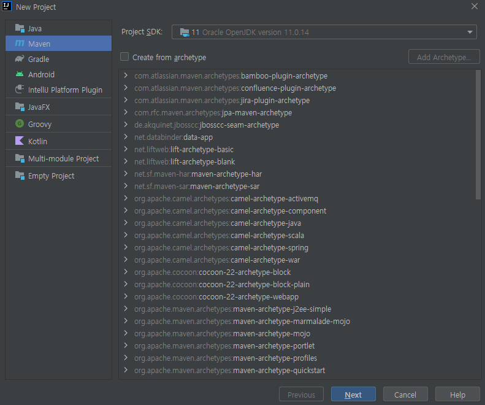
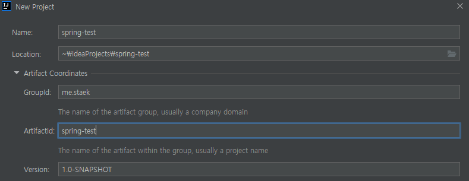

### 스프링부트 시작하기

##### 기본적인 스프링부트 프로젝트를 만들어서 시작해보자

###### 참조문서 

https://docs.spring.io/spring-boot/docs/2.0.3.RELEASE/reference/htmlsingle/#getting-started-maven-installation

- intellij의 maven 선택

- groupid, artifactid, project name을 선택한다.

###### package 생성

- me.staek

~~~java
@SpringBootApplication
public class Application {
    public static void main(String[] args) {
        SpringApplication.run(Application.class,args);
    }
}
~~~

###### pom.xml 생성

~~~xml
<?xml version="1.0" encoding="UTF-8"?>
<project xmlns="http://maven.apache.org/POM/4.0.0" xmlns:xsi="http://www.w3.org/2001/XMLSchema-instance"
	xsi:schemaLocation="http://maven.apache.org/POM/4.0.0 http://maven.apache.org/xsd/maven-4.0.0.xsd">
	<modelVersion>4.0.0</modelVersion>

	<groupId>com.example</groupId>
	<artifactId>myproject</artifactId>
	<version>0.0.1-SNAPSHOT</version>

	<!-- Inherit defaults from Spring Boot -->
	<parent>
		<groupId>org.springframework.boot</groupId>
		<artifactId>spring-boot-starter-parent</artifactId>
		<version>2.0.3.RELEASE</version>
	</parent>

	<!-- Add typical dependencies for a web application -->
	<dependencies>
		<dependency>
			<groupId>org.springframework.boot</groupId>
			<artifactId>spring-boot-starter-web</artifactId>
		</dependency>
	</dependencies>

	<!-- Package as an executable jar -->
	<build>
		<plugins>
			<plugin>
				<groupId>org.springframework.boot</groupId>
				<artifactId>spring-boot-maven-plugin</artifactId>
			</plugin>
		</plugins>
	</build>

</project>
~~~

