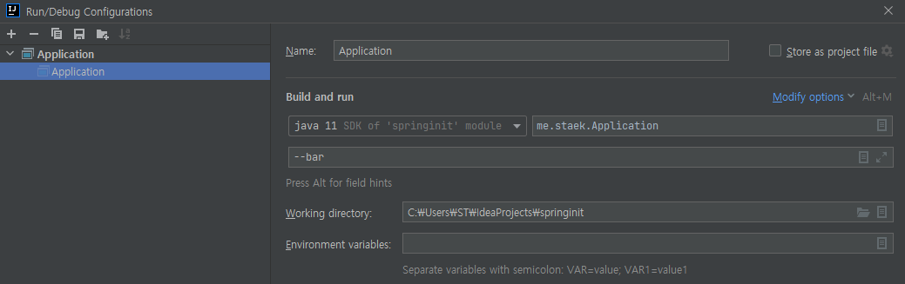
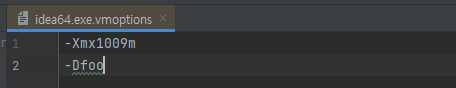

## SpringApplication


##### spring boot banner - 파일설정

```
==============================
staek spring boot ${application.version}
==============================
```

- /resources/banner.txt

- 스프링부트 시작 시 `banner.txt` 내용이 표출된다.

- `${spring-boot.version}` 등의 변수를 사용할 수 있음.

  - `MENIFEST.MF`에 정의 되어야 사용이 가능함. (jar로 실행)

  


##### spring boot banner - 소스설정

~~~java
@SpringBootApplication
public class Application {
    public static void main(String[] args) {
        SpringApplication application = new SpringApplication(Application.class);
        application.setBannerMode(Banner.Mode.OFF);
        application.run(args);
    }
}
~~~

- 배너 끄기


~~~java
@SpringBootApplication
public class Application {
    public static void main(String[] args) {
        SpringApplication application = new SpringApplication(Application.class);
        application.setBanner(new Banner() {
            @Override
            public void printBanner(Environment environment, Class<?> sourceClass, PrintStream out) {
                out.println("===============");
                out.println("code level staek spring boot");
                out.println("===============");

            }
        });
        application.run(args);
    }
}
~~~

- 배너클래스를 구현하고 `setBanner()` 로 설정 가능

 


#### Application Listener

```java
@SpringBootApplication
public class Application {
    public static void main(String[] args) {
        SpringApplication application = new SpringApplication(Application.class);
        application.addListeners(new SampleListener());
        application.setWebApplicationType(WebApplicationType.NONE);
        application.run(args);

    }
}
@Component
public class SampleListener implements ApplicationListener<ApplicationStartingEvent> {
    @Override
    public void onApplicationEvent(ApplicationStartingEvent applicationStartingEvent) {
        System.out.println("===========================");
        System.out.println("Application is starting");
        System.out.println("===========================");
    }
}
```

- applicationLisner를 ApplicationStartingEvent타입으로 구현한 `SampleListener`를`bean` 으로 등록 후 시작하면 `onApplicationEvent`가 실행되지 않는다.
- `ApplicationContext` 가 생성되기 전에 발생한 이벤트는 `@Bean`으로 등록할 수 없다.
- 동작시키기 위해서는 `application.addListeners(new SampleListener());` 와 같이 리스너를 직접 등록해준다.


~~~java
@Component
public class SampleListener implements ApplicationListener<ApplicationStartedEvent> {
    @Override
    public void onApplicationEvent(ApplicationStartedEvent applicationStartedEvent) {
        System.out.println("===========================");
        System.out.println("Application is started");
        System.out.println("===========================");
    }
}
~~~

- `ApplicationStartedEvent` 리스너는 `ApplicationContext`가 생성된 후 발생되는 이벤트이므로 작동한다.


##### Application Argument



- Application Argument 옵션은 `--` 로 시작한다.



- vm option은 `-` 로 시작한다.
- intellij > help > edit customs vmoptions


~~~
 java -jar .\target\spring-init-1.0-SNAPSHOT.jar -Dfoo --bar
~~~

- jar실행 시 직접 명령어로 옵션을 설정할 수 있다.


```java
@Component
public class SampleListener {
    public SampleListener(ApplicationArguments arguments) {
        System.out.println("foo : " + arguments.containsOption("foo"));
        System.out.println("bar : " + arguments.containsOption("bar"));
    }
}
```

- Application argument 옵션인 bar는 true, vm option은 false로 출력되어
- vm option은  application argument에 포함되지 않는다는 걸 알 수 있다/

결과

~~~
foo : false
bar : true
~~~


##### application 실행 후 무언가 실행할 때 Runner를 사용

```java
@Component
@Order(1) // ApplicationRunner가 여러개일때 순서를 정한다.
public class SampleListener implements ApplicationRunner {
    @Override
    public void run(ApplicationArguments args) throws Exception {
        System.out.println("foo : " + args.containsOption("foo"));
        System.out.println("bar : " + args.containsOption("bar"));
    }
}
```

```java
@Component
public class SampleListener implements CommandLineRunner {
    @Override
    public void run(String... args) throws Exception {
        Arrays.stream(args).forEach(System.out::println);
    }
}
```


참조 <https://docs.spring.io/spring-boot/docs/current/reference/html/features.html#features.spring-application>


